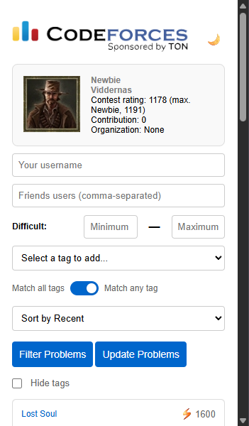
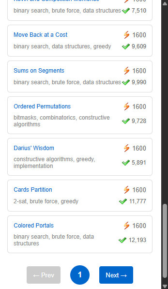
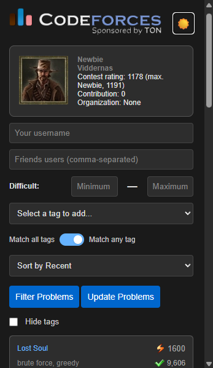
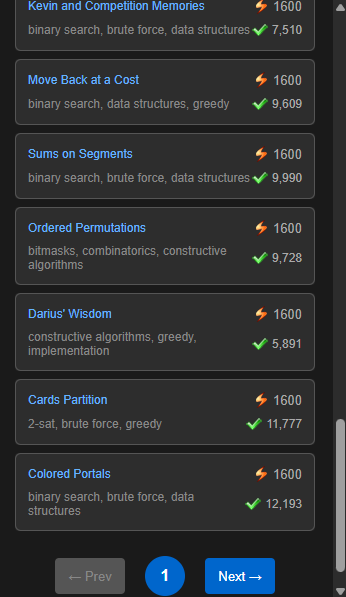

# 🏆 Codeforces Extension

A powerful Chrome extension that enhances your Codeforces experience with advanced problem filtering, user statistics, and a beautiful modern interface.

## ✨ Features

### 🎯 **Smart Problem Filtering**
- **Difficulty Range**: Filter problems by minimum and maximum rating
- **Tag-Based Filtering**: Select from 20+ programming tags with visual tag management
- **AND/OR Logic**: Choose between "match all tags" or "match any tag" filtering
- **Solved Count Integration**: See how many people solved each problem

### 👤 **User Management**
- **Multi-User Support**: Track your progress and compare with friends
- **User Statistics**: View comprehensive user information and ratings
- **Friend Comparison**: Add multiple friends to compare progress

### 🎨 **Modern Interface**
- **Card-Based Design**: Beautiful problem cards with hover effects
- **Dark/Light Mode**: Toggle between themes with smooth transitions
- **Responsive Layout**: Clean, organized interface that works perfectly
- **Pagination System**: Browse through problems with elegant navigation

### 🚀 **Advanced Functionality**
- **Real-Time Caching**: Fast problem loading with intelligent cache management
- **Sort Options**: Sort by recent problems or most solved
- **Hide Tags Option**: Toggle problem tags visibility for cleaner view
- **ES6 Modular Architecture**: Clean, maintainable codebase

## 📸 Screenshots

### Light Mode Interface

*Clean and modern light theme interface*


*Problem filtering and tag management in light mode*

### Dark Mode Interface  

*Sleek dark theme with the same powerful functionality*


*Dark mode problem cards and filtering options*

## 🛠️ Installation

### From Source
1. **Clone the repository**
   ```bash
   git clone https://github.com/LucaslPedrosa/CodeforcesExtension.git
   cd CodeforcesExtension
   ```

2. **Load in Chrome**
   - Open Chrome and go to `chrome://extensions/`
   - Enable "Developer mode" in the top right
   - Click "Load unpacked" and select the project folder
   - The extension will appear in your browser toolbar

3. **Start Using**
   - Click the Codeforces icon in your toolbar
   - Enter your username and start filtering problems!

## 📚 Quick Start Guide

### � **Step-by-Step Tutorial**

1. **📥 Load Your Profile**
   - Enter your **username** in the username input field
   - This will load your profile information and solved problems

2. **👥 Add Friends (Optional)**
   - Enter your **friends' usernames** separated by commas in the friends field
   - Example: `friend1, friend2, friend3`
   - This helps filter problems that your friends have solved but you haven't

3. **⚙️ Set Your Preferences**
   - **Set difficulty range**: Enter minimum and maximum ELO ratings
   - **Add tags**: Select programming tags from the dropdown (they appear as removable pills)
   - **Choose tag logic**: Toggle between "Match all tags" (AND) or "Match any tag" (OR)
   - **Select sort method**: Choose "Sort by Recent" or "Sort by Most Solved"

4. **🔄 Update Problems Database**
   - Click **"Update Problems"** to fetch all problems from Codeforces
   - This saves the problems data in the extension for fast filtering
   - ⚡ *Only needed once or when you want fresh data*

5. **🔍 Filter and Explore**
   - Click **"Filter Problems"** to apply your filtering parameters
   - Browse through problems using the pagination controls
   - Click on any problem card to open it on Codeforces

### � **Pro Tips**
- **First time?** Always click "Update Problems" before filtering
- **Tag management**: Click the "×" on any tag pill to remove it
- **Theme switching**: Use the 🌙 button to toggle dark/light mode
- **Hide tags**: Check "Hide tags" for a cleaner problem view

## 📚 Detailed Usage

### 🔍 **Advanced Filtering**
- **Difficulty Range**: Set min/max ELO to focus on your skill level
- **Tag Combinations**: Use multiple tags with AND/OR logic for precise filtering
- **Solve Count**: See how popular each problem is based on solve statistics
- **Friend Comparison**: Discover problems your friends solved that you haven't attempted

### 👥 **Friend Management**
- Add multiple friends to compare your progress
- The extension highlights unsolved problems from your friend group
- Perfect for competitive programming study groups

### 🎛️ **Customization Options**
- **Theme Toggle**: Switch between light and dark modes instantly
- **Tag Visibility**: Hide problem tags for a minimalist view
- **Sorting Options**: Organize problems by recency or popularity
- **Pagination**: Navigate through large result sets efficiently

## 🏗️ Technical Architecture

### **Frontend**
- **HTML5**: Semantic structure with modern form elements
- **CSS3**: Modular stylesheets with CSS Grid and Flexbox
- **JavaScript ES6**: Modern modules with clean separation of concerns

### **API Integration**
- **Codeforces API**: Real-time problem and user data
- **Data Merging**: Combines problems with solve statistics
- **Intelligent Caching**: Optimized performance with localStorage

### **File Structure**
```
CodeforcesExtension/
├── 📁 css/                 # Modular stylesheets
│   ├── base.css           # Core styles
│   ├── dark-mode.css      # Dark theme
│   ├── forms.css          # Form and card styles
│   └── theme-toggle.css   # Theme switching
├── 📁 js/                  # ES6 modules
│   ├── api.js             # Codeforces API integration
│   ├── problem-filter.js  # Filtering and pagination
│   ├── tag-manager.js     # Tag management system
│   ├── theme.js           # Theme switching logic
│   └── storage.js         # localStorage management
├── 📁 icons/              # Extension assets
├── manifest.json          # Extension configuration
├── popup.html            # Main interface
└── popup.js              # Main application logic
```

## 🎯 Key Highlights

- **🚀 Fast Performance**: Intelligent caching and optimized API calls
- **🎨 Beautiful UI**: Modern card design with smooth animations
- **🧩 Modular Code**: Clean ES6 architecture for easy maintenance
- **🌓 Dual Theme**: Complete dark/light mode support
- **📱 Responsive**: Works perfectly on all screen sizes
- **🔧 Extensible**: Easy to add new features and customize

## 🤝 Contributing

Contributions are welcome! Feel free to:
- 🐛 Report bugs
- 💡 Suggest new features  
- 🔧 Submit pull requests
- 📖 Improve documentation

## 📄 License

This project is licensed under the MIT License - see the [LICENSE](LICENSE) file for details.

## 🙏 Acknowledgments

- **Codeforces**: For providing the amazing competitive programming platform and API
- **Chrome Extensions**: For the excellent extension framework
- **Open Source Community**: For inspiration and best practices

---

<div align="center">

**Made with ❤️ for the competitive programming community**

[⭐ Star this repo](https://github.com/LucaslPedrosa/CodeforcesExtension) • [🐛 Report Bug](https://github.com/LucaslPedrosa/CodeforcesExtension/issues) • [💡 Request Feature](https://github.com/LucaslPedrosa/CodeforcesExtension/issues)

</div>
